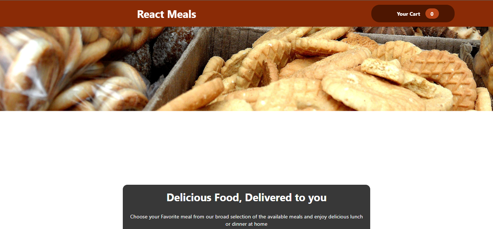
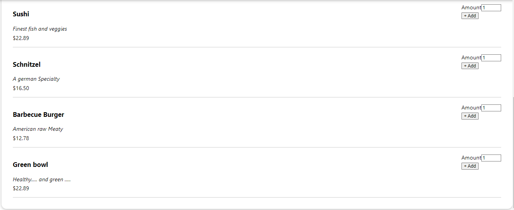

## Project Description

Our food order website, built using React and the Context API, allows users to easily browse and select from a variety of menu items. The user interface is user-friendly, with clear categories and options for customization. The site also utilizes the power of the Context API to manage and update the user's order in real-time, without the need for multiple page reloads. This means that users can quickly and efficiently add items to their cart, adjust quantities, and proceed to checkout with ease. Additionally, the site's responsive design ensures that it looks great and functions smoothly on any device. Overall, our food order website offers a seamless online ordering experience for customers.

## Technology Used :

- ReactJs : JavaScript's library React.js is used to develop the application.
- JavaScript :  JavaScript's basics and some advanced concepts 
- JSX : JavaScript XML is used to structure the page and using Different UI components inside React.js.
- Css : Cascading Style Sheets use for the responsive

## What I've Learnt :

I have Learnt :
- In this project, I learnt Context api , Add to cart features

## Setup Project

Get a clone of application from [Here](https://github.com/sachinrao-dev/Food-order)
### `npm start`

Runs the app in the development mode. Open [http://localhost:3000](http://localhost:3000) to view it in your browser.
The page will reload when you make changes. You may also see any lint errors in the console.

## Initial View 

## list of meal 

